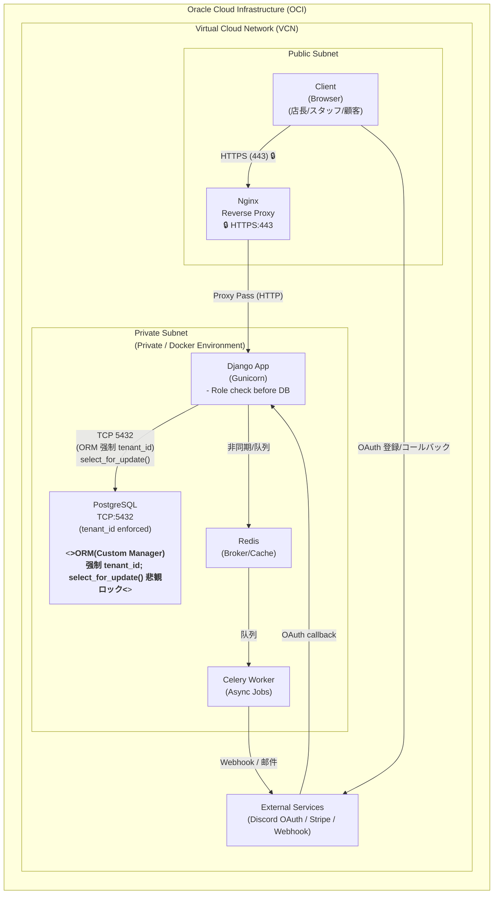

# Rosterly — 部署图规范与要素（整合版）

本文件把为你准备部署图所需的一切信息整合为可直接用于“AI作图”或手工绘制的规范说明（中文）。目标：清晰、可审计、能直接产出演示级或工程级的部署图。

---

## 一、目标视图与用途
- 视图：物理部署 / 网络与安全边界（Deployment View）
- 用途：作品集展示、面试讲解、与运维/安全沟通

---

## 二、网络边界与分层（必须在图上明确的Bounding Boxes）
1. 最外层：`Oracle Cloud Infrastructure (OCI)`（大框）
2. VCN / VPC：`Virtual Cloud Network (VCN)` 或 `VPC`（在OCI内）
3. 子网：
   - Public Subnet（可被公网访问）
   - Private Subnet（与公网隔离的安全区域）
4. Private Subnet 内：`Docker Environment`（容器运行环境）

在图上用明显不同的背景色分别标识 Public / Private 子网。

---

## 三、组件（Nodes）
请在图中按以下位置放置组件并用短标题与小注释标明实现要点。

- 外部网络（VCN外）
  - `Client (Browser)` — 店长 / 员工 / 顾客
  - `External Services` — Discord OAuth / Stripe / 邮件 / Webhook

- Public Subnet
  - `Nginx (Reverse Proxy)` — 唯一的外网入口，TLS 443 终端（标注 🔒）

- Private Subnet → Docker Environment
  - `Django App (Gunicorn)` — 后端 API / 管理界面 / RAG agent 等
  - `PostgreSQL` — 主数据库（TCP 5432）
  - `Redis` — 缓存 / Celery Broker
  - `Celery Worker` — 异步任务处理

---

## 四、连线与标签（Edges）
每条连线应当在图上清晰标注协议、端口和关键安全/一致性说明：

1. `Client` ➔ `Nginx`
   - 标签：`HTTPS (Port 443)`
   - 图标/注记：🔒（SSL/TLS）

2. `Nginx` ➔ `Django App`
   - 标签：`Proxy Pass (HTTP)`

3. `Django App` ➔ `PostgreSQL`
   - 标签：`TCP (Port 5432)`
   - 强显注释（在连线上或DB旁用显眼颜色写）：
     > ORM層(Custom Manager)で全クエリに tenant_id 条件を強制適用し、データ隔離を担保。悲観的ロック(select_for_update)による排他制御を実装。

4. `Django App` ➔ `Redis` ➔ `Celery Worker`
   - 标签：`非同期タスク / キュー（Redis）`

5. `Celery Worker` ➔ `External Services`
   - 标签：`Webhook / メール通知`

6. `Client` ➔ `External Services` ➔ `Django App`（OAuth 回调）
   - 标签：`OAuth 認証コールバック`

---

## 五、安全与运维要点（放在图角或图注中）
- TLS：外部全部入口必须使用 TLS（Nginx 端 443），内部服务间通信在可能时也采用 TLS（数据库可使用内部TLS或VPC私网+pg_hba限制）。
- API 集成鉴权：Integration API 使用 `X-Tenant-Key` + `X-Tenant-Timestamp` + `X-Tenant-Signature(HMAC_SHA256)`，并实施重放防护与时间窗（参考 `system_b_saas/config/settings.py` 的相关设置）。
- 日志与可观测性：应用日志、访问日志、审计日志（特别是 SSO / 订单 / 越权拒绝）必须集中存储并定期导出。
- 备份与恢复：`PostgreSQL` 持久卷定期快照；`Redis` 持久化或定期备份任务。

---

## 六、图形设计规范（给AI或设计师的具体指令）
- 配色：主色系用蓝色 (#1976D2)、辅助灰 (#6B7280)、背景白/浅灰。Public Subnet 用浅蓝背景，Private Subnet 用浅橙/米色背景以强调隔离。数据库节点用暖色突出（橙）并带锁图标。
- 字体大小：组件名称 14–16px，说明文字 10–12px。关键注释（如 tenant_id 强制、select_for_update）使用加粗并配黄色背景块。
- 图标：Nginx 用倒三角或服务器图标 + 🔒；DB 用圆柱体图标 + 🔒；外部服务使用云图标。
- 布局：左上角放 `Client`，右侧放 `External Services`，中间自上而下为 `Ingress (Nginx)` -> `Public Subnet` -> `Private Subnet (Docker)`。

---

## 七、Mermaid（推荐的清晰版模板，AI可直接渲染）
将以下 Mermaid 片段直接粘贴到支持 Mermaid 的编辑器/渲染器中：



> 说明：上面 `POSTGRES` 节点中的 `<<strong>>...<</strong>>` 为强调用法，部分 Mermaid 渲染器可能需要替换为注释或额外文本节点以保证兼容性。

---

## 八、与当前代码/配置的对应关系（项目中可参考的文件）
请在绘制工程级部署图时参考下列仓库文件以保证一致性：

- 部署脚本/Compose：`compose.rosterly.yml`, `compose.veludo.yml`, `docker-compose.yml`
- 发布脚本：`deploy_scripts/deploy_b.sh`, `deploy_scripts/deploy_a.sh`
- Dockerfile：`Dockerfile`
- SaaS 配置与鉴权设定：`system_b_saas/config/settings.py`
- 多租户模型与约束：`system_b_saas/tenants/models.py`
- 资源/排班/预约模型：`system_b_saas/resources/models.py`, `system_b_saas/bookings/models.py`

在图注中标明这些文件路径可以增加技术可信度（例如：在“DB 注释”处标注 `参照: system_b_saas/tenants/models.py`）。

---

## 九、导出与使用建议
- 若要在博客/作品集中使用矢量图，建议将 Mermaid 渲染为 SVG，然后在设计工具中微调。可使用 `mmdc`（Mermaid CLI）或 VS Code 的 Mermaid プラグイン导出。示例命令：

```bash
# 安装 mermaid-cli（若已安装，请跳过）
npm install -g @mermaid-js/mermaid-cli

# 导出为 SVG
mmdc -i diagram.mmd -o diagram.svg
```

- 若需要 PPT 演示或面试投屏，生成 PNG (高分辨率) 或 SVG，并把关键注释（tenant_id、select_for_update）放在图下方的要点栏里以便讲解。

---

## 十、简短讲稿（面试用 60-90 秒）
> 我会把系统最小化说明为三层：Ingress、应用层、数据层。外部请求先到 Nginx 做 TLS 终端与反向代理；应用层运行在私有子网的容器化 Django，负责业务和权限校验；数据层包含隔离的 PostgreSQL（每条主表记录带 tenant_id），以及 Redis/Celery 负责异步任务。对于关键并发预订场景，后端在写入时使用悲观锁（select_for_update）并辅以数据库级唯一约束避免超卖。与外部 LLM 或第三方集成时，所有出入外部的文本会通过审计/脱敏的 AI Security Gateway，保证 PII 不被泄露并记录可审计日志。

---

如需我把这份规范直接转换为一张干净的Mermaid图（我已在 `docs/diagrams/` 下放置草稿文件），或导出为 `SVG/PNG`，告诉我你偏好的尺寸与用途（博客/演示/技术附件），我会继续生成并提交。
