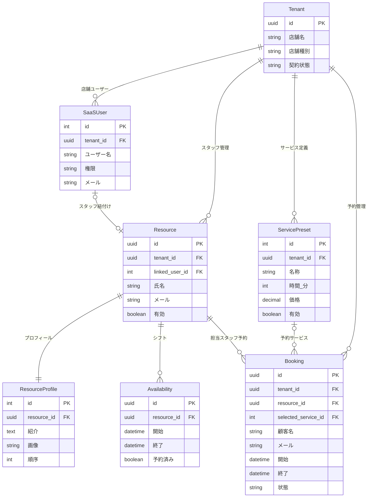
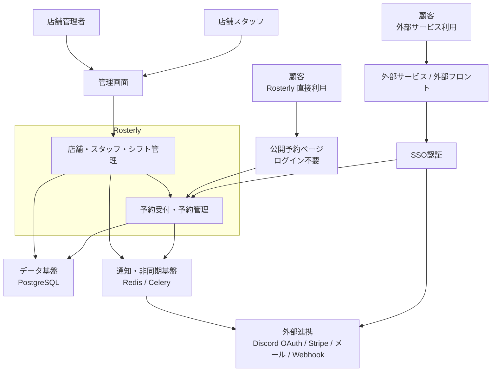

# Rosterly 図プレビュー

営業資料・提案資料で使いやすいように、情報量を絞った日本語版です。

## 1. 簡略ER図

```mermaid
erDiagram
    Tenant {
        uuid id PK
        string 店舗名
        string 店舗種別
        string 契約状態
    }

    SaaSUser {
        int id PK
        uuid tenant_id FK
        string ユーザー名
        string 権限
        string メール
    }

    Resource {
        uuid id PK
        uuid tenant_id FK
        int linked_user_id FK
        string 氏名
        string メール
        boolean 有効
    }

    ResourceProfile {
        int id PK
        uuid resource_id FK
        text 紹介
        string 画像
        int 順序
    }

    Availability {
        uuid id PK
        uuid resource_id FK
        datetime 開始
        datetime 終了
        boolean 予約済み
    }

    ServicePreset {
        int id PK
        uuid tenant_id FK
        string 名称
        int 時間_分
        decimal 価格
        boolean 有効
    }

    Booking {
        uuid id PK
        uuid tenant_id FK
        uuid resource_id FK
        int selected_service_id FK
        string 顧客名
        string メール
        datetime 開始
        datetime 終了
        string 状態
    }

    Tenant ||--o{ SaaSUser : "店舗ユーザー"
    Tenant ||--o{ Resource : "スタッフ管理"
    Tenant ||--o{ ServicePreset : "サービス定義"
    Tenant ||--o{ Booking : "予約管理"

    SaaSUser o|--o| Resource : "スタッフ紐付け"
    Resource ||--|| ResourceProfile : "プロフィール"
    Resource ||--o{ Availability : "シフト"
    Resource ||--o{ Booking : "担当スタッフ予約"

    ServicePreset o|--o{ Booking : "予約サービス"
```

## 2. 簡略構成図

```mermaid
flowchart TB
    customerExternal["顧客<br/>外部サービス利用"]
    customerDirect["顧客<br/>Rosterly 直接利用"]
    staff["店舗スタッフ"]
    admin["店舗管理者"]

    ext["外部サービス / 外部フロント"]
    sso["SSO認証"]
    publicBooking["公開予約ページ<br/>ログイン不要"]
    dashboard["管理画面"]

    subgraph platform["Rosterly"]
        booking["予約受付・予約管理"]
        operations["店舗・スタッフ・シフト管理"]
    end

    data["データ基盤<br/>PostgreSQL"]
    async["通知・非同期基盤<br/>Redis / Celery"]
    integrations["外部連携<br/>Discord OAuth / Stripe / メール / Webhook"]

    customerExternal --> ext --> sso --> booking
    customerDirect --> publicBooking --> booking
    staff --> dashboard
    admin --> dashboard
    dashboard --> operations

    operations --> booking
    booking --> data
    operations --> data
    booking --> async
    operations --> async

    sso --> integrations
    async --> integrations
```
